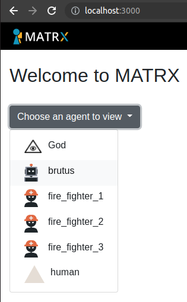
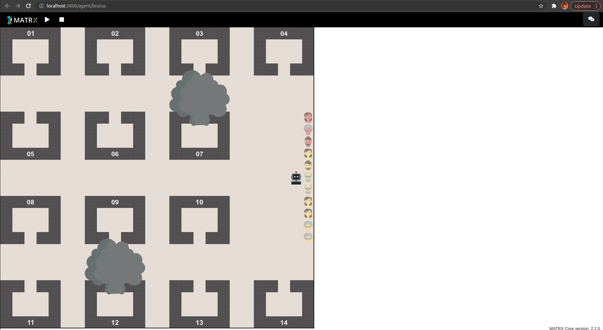
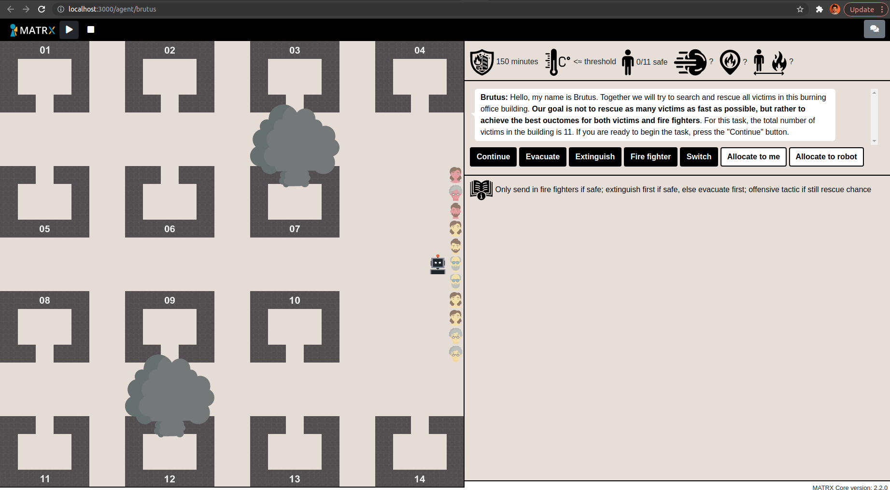
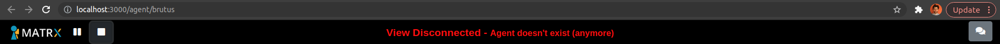

# Explainable AI for Meaningful Human Control
## Installation
1. Install the Docker version for your OS: https://docs.docker.com/engine/install/
2. Start the Docker service: 
```bash
sudo service docker start
```
3. Install the Docker image:
```bash
sudo docker build -t xai4mhc .
```
4. Run the Docker image to start the tutorial:
```bash
sudo docker run -p 3000:3000 -p 3001:3001 -e PARTICIPANT_ID="1" -e ENVIRONMENT_TYPE="trial" -e IS_DOCKER="true" --rm xai4mhc
```
5. Or run the Docker image to start the official experiment:
```bash
sudo docker run -v $(pwd)/experiment_logs:/usr/src/app/experiment_logs -v $(pwd)/data:/usr/src/app/data -p 3000:3000 -p 3001:3001 -e PARTICIPANT_ID="1" -e ENVIRONMENT_TYPE="experiment" -e CONDITION="shap" -e COUNTERBALANCE_CONDITION="1" -e IS_DOCKER="true" --rm xai4mhc
```
    - ```
    -v $(pwd)/experiment_logs:/usr/src/app/experiment_logs # stores experiment logs locally
    ```

    - ```
    -v $(pwd)/data:/usr/src/app/data # stores output data locally
    ```

    - ```
    -p 3000:3000 # maps port 3000 of the container to port 3000 on the host
    ```

    - ```
    -p 3001:3001 # maps port 3001 of the container to port 3001 on the host
    ```

    - ```
    -e PARTICIPANT_ID = "1" # determines the enviroment variable PARTICIPANT_ID. You can replace this number with the ID of your choice
    ```

    - ```
    -e ENVIRONMENT_TYPE = "experiment" # determines the environment variable ENVIRONMENT_TYPE. You can choose either "trial" or "experiment" for this variable
    ```

    - ```
    -e CONDITION = "shap" # determines the environment variable CONDITION. You can choose one of the explanation conditions "baseline", "shap", or "util"
    ```

    - ```
    -e COUNTERBALANCE_CONDITION = "1" # determine the environment variable COUNTERBALANCE_CONDITION. You can choose one of the conditions "1", "2", "3", "4", "5", "6", "7", or "8"
    ```

    - ```
    -e IS_DOCKER = "true" # determine the environment variable IS_DOCKER. Keep this environment variable, as it is used to distinguish between running the repository locally or using Docker
    ```
    
    - ```
    --rm # automatically removes the container when it exits
    ```
    
    - ```
    xai4mhc # specify the Docker image to use
    ```
6. Visit the web GUI at: localhost:3000. In the dropdown menu to choose an agent to view, select brutus or titus (depending on your counterbalance condition) if you want to play the task as a participant. With the God view you can observe everything in the environment, this mode is recommended when acting as the experimenter.

 

7. On the start screen of the first task, open the messaging interface with the button on the top right of the page:



8. Press the play button on the top left of the page, this will show the first message from the robot:



9. You can now complete the first task. Pay attention that the task automatically pauses with 100 and 50 minutes remaining. After finishing the first task, the view of the current robot will be disconnected:



10. You can now go back to localhost:3000 and in the dropdown menu to choose an agent to view, select brutus or titus (depending on your counterbalance condition). You can now complete the second task. After the first task finished, you will see an OS error that can be ignored and will be overwritten when starting the second task:
```
OSError: [Errno 98] Address already in use
```
11. The second task will again automatically pause with 100 and 50 minutes remaining. After finishing the second task, the complete experiment logs can be found locally in the experiment_logs directory and the aggregated data in the data directory.

## Task
The objective of the task is to find target victims in the different areas and carry them to the drop zone. Rescuing mildly injured victims (yellow color) add three points to the total score, rescuing critically injured victims (red color) adds six points to the total score. Critically injured victims can only be carried by both human and agent together. Areas can be blocked by three different obstacle types. One of these can only be removed together, one only by the agent, and one both alone and together (but together is much faster). The world terminates after successfully rescuing all target victims, or after 8 minutes. Save the output logs by pressing the stop icon in the 'God' view, which can then be found in the 'experiment_logs' folder. The image below shows the 'God' view and the messaging interface. 
